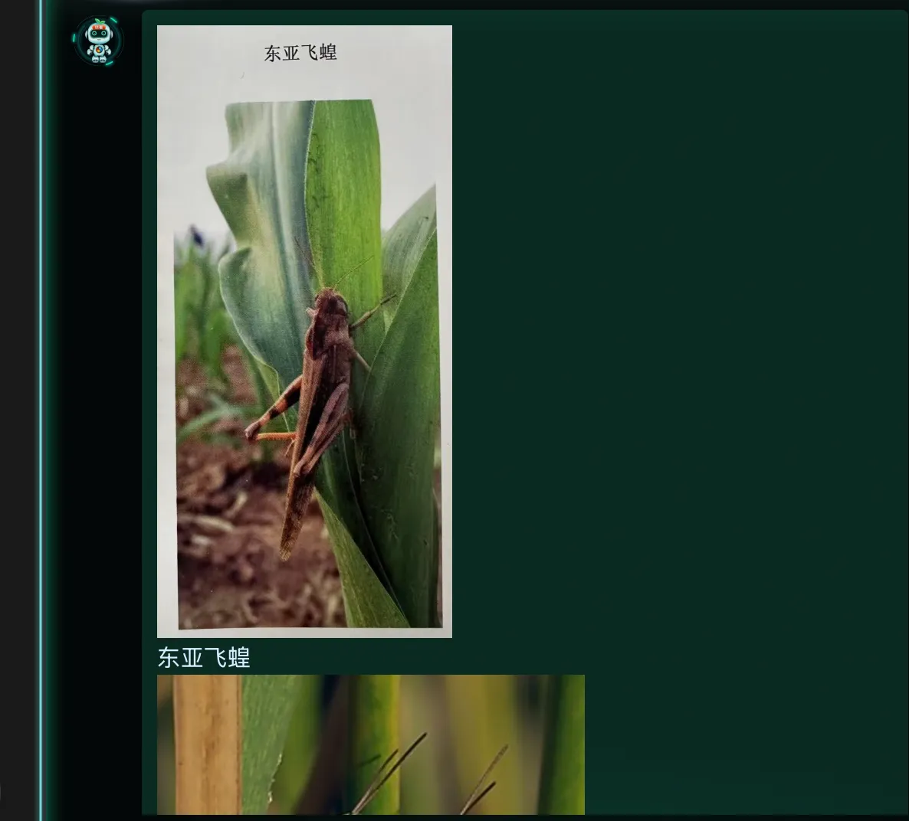
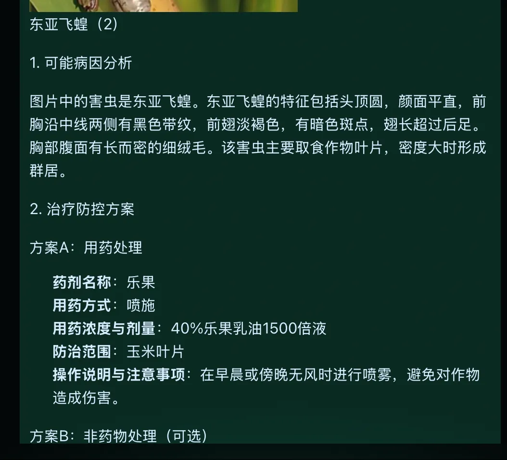
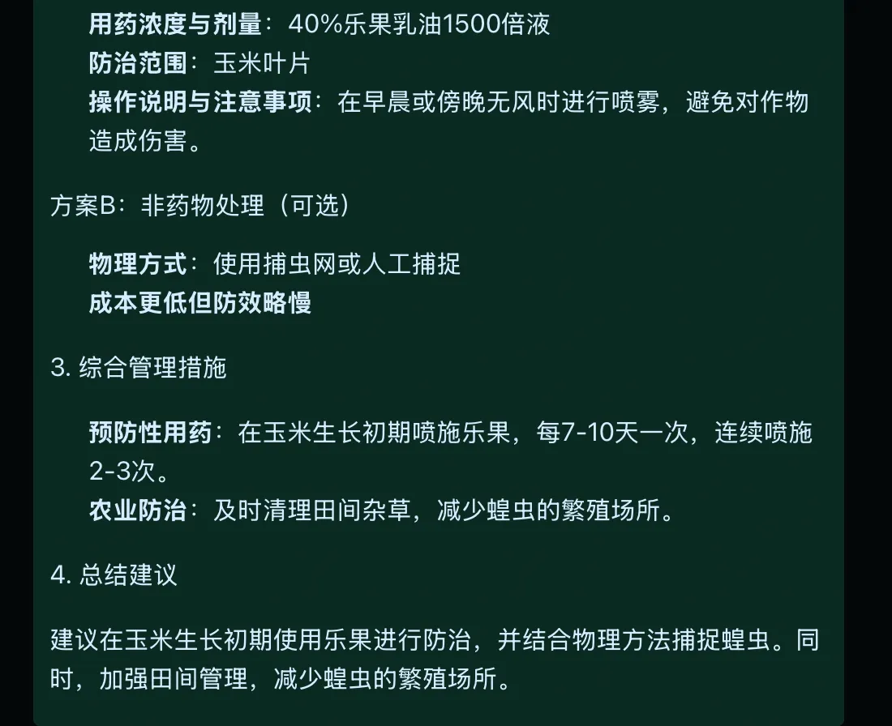
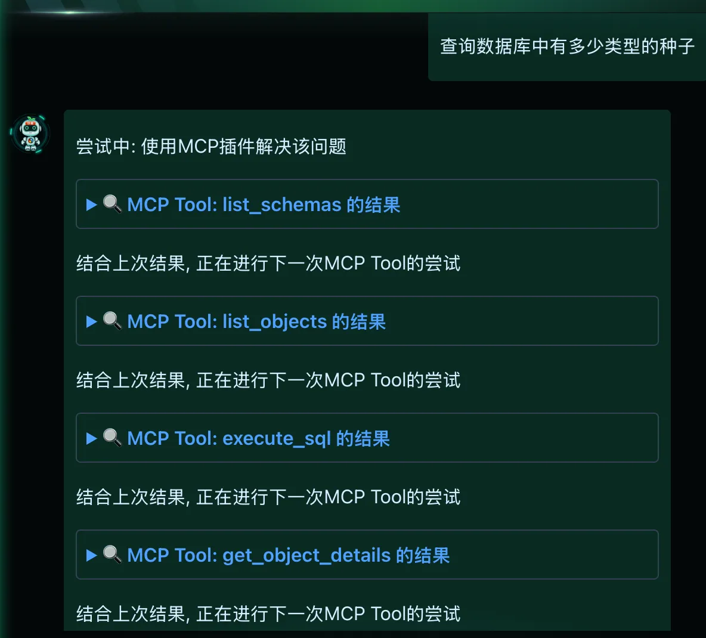
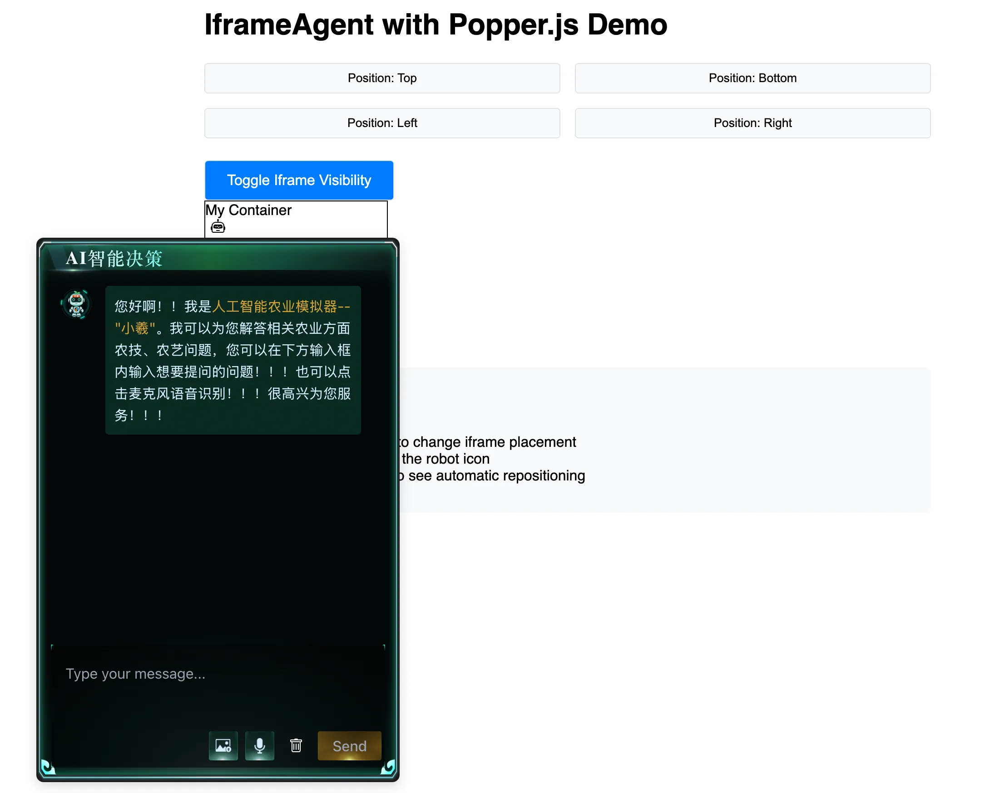

# 🌾 Agriculture Assistant

🤖 This repository contains a comprehensive Agriculture Assistant system leveraging Large Language Models (LLM) to provide intelligent agricultural advice and data analysis. The project is structured into three main sub-projects:

- 🎯 Frontend: A responsive chat interface for user interaction
- ⚡ Backend: The core logic and LLM integration
- 🔍 RAG: Retrieval-Augmented Generation system for knowledge retrieval

## 🚀 Getting Started

### 📋 Prerequisites

- Node.js (v18 or later)
- pnpm (v8 or later)
- Python 3.9+
- Ollama (for local LLM deployment)

### Quick Start

1. Clone the repository  

```bash
git clone https://github.com/DreamsComingTrue/agriculture-chatbot.git
cd agriculture-chatbot
```

2. Follow the setup instructions in each sub-project's README:

- [Frontend](/frontend/README.md)
- [Backend](/backend/README.md)
- [RAG](/RAG/README.md)

## ✨ Features Overview

- 📱 Multi-modal input support (text, image, audio)
- 🔊 Audio output with Mandarin support
- 🧠 Knowledge retrieval via RAG system
- 🔌 Integrated MCP tool to access Postgres DB
- 🌐 Responsive UI with internationalization support

## 🎥 Demo

Retrieve images from RAG and enhance answers





Utilize MCP Tool to get data from PostgresDB answering questions



Export as a NPM package for seamlessly integrating


